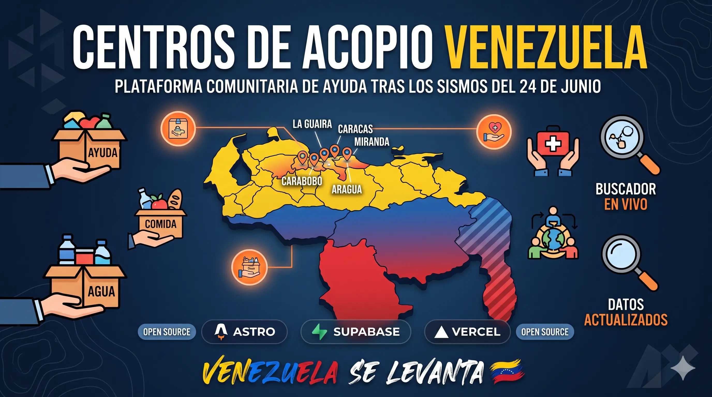

<p align="center">
  
</p>

<p align="center">
  
  
  
  
  
  
  
  
</p>

<p align="center">
  <strong>Encuentra centros de acopio y números de emergencia activos en todo el país.</strong>
  <br>
  Carga al instante incluso en conexiones móviles inestables.
</p>

<br>

El **24 de junio de 2026**, dos sismos de magnitud **7.5 y 7.2** sacudieron la región central de Venezuela, afectando severamente a Caracas y los estados Miranda, La Guaira, Aragua y Carabobo.

Esta plataforma **centraliza la información de los centros de acopio** habilitados en todo el país, permitiendo que los ciudadanos encuentren rápidamente dónde llevar donaciones y consulten los números de emergencia activos. Es un proyecto de código abierto impulsado por la comunidad.

---

## Funcionalidades

- **Mapa de estados** con indicación de zonas afectadas prioritarias
- **Buscador en vivo** por nombre, ciudad, estado o insumos
- **Filtro por ciudades** agrupadas por zonas afectadas
- **Página por estado** con centros agrupados por ciudad
- **Datos en vivo** desde Supabase con fallback offline automático
- **Sugerir centro de acopio** mediante formulario público (requiere moderación)
- **Sugerir enlace de ayuda** mediante formulario público
- **Sección de enlaces** con límite de 2 filas y botón "Ver más / Ver menos"
- **Números de emergencia** nacionales y por categoría
- **Modo offline** con datos estáticos embebidos cuando no hay conexión

## Estructura del proyecto

```
src/
├── components/       # Componentes reutilizables
│   ├── Navbar.astro
│   ├── Hero.astro
│   ├── Footer.astro
│   ├── AlertBox.astro
│   ├── StatsRow.astro
│   ├── SearchFilters.astro
│   ├── InsumosSection.astro
│   ├── EnlacesSection.astro
│   ├── EmergenciaCTA.astro
│   ├── SugerirCentroModal.astro
│   └── SugerirEnlaceModal.astro
├── data/             # Datos estáticos de fallback
│   ├── acopio.json
│   ├── centros.js
│   ├── emergencia.js
│   └── numerosemergencia.json
├── layouts/          # Layout base de la aplicación
│   └── Layout.astro
├── lib/              # Utilidades compartidas
│   └── supabase.js
├── pages/            # Rutas de la aplicación
│   ├── index.astro
│   ├── emergencia.astro
│   └── estado/[estado].astro
├── scripts/          # Scripts de utilidad
│   └── seed-supabase.js
└── styles/           # Hojas de estilo modulares
    ├── global.css
    ├── navbar.css
    ├── hero.css
    ├── footer.css
    ├── modal.css
    ├── enlaces.css
    ├── index.css
    ├── emergencia.css
    └── estado.css
```

## Desarrollo

```bash
# Instalar dependencias
pnpm install

# Iniciar servidor de desarrollo
pnpm dev

# Compilar para producción
pnpm build

# Previsualizar build
pnpm preview
```

### Variables de entorno

Copia `.env.example` a `.env` y configura las credenciales de Supabase:

```
PUBLIC_SUPABASE_URL=https://tu-proyecto.supabase.co
PUBLIC_SUPABASE_ANON_KEY=tu-anon-key
```

Sin estas variables la app funciona en modo offline con los datos embebidos.

### Poblar la base de datos

```bash
node src/scripts/seed-supabase.js
```

## Contribuir

1. Haz fork del repositorio
2. Crea una rama para tu funcionalidad (`git checkout -b feat/mi-mejora`)
3. Haz commit de tus cambios
4. Abre un Pull Request

Toda contribución que ayude a mejorar la respuesta ante emergencias es bienvenida.

---

<p align="center">
  Hecho con ❤️ por la comunidad venezolana — <strong>Venezuela se levanta</strong>
  <br><br>
  <a href="https://github.com/Nokx1z/infoayudavenezuela/graphs/contributors">
    
  </a>
</p>
