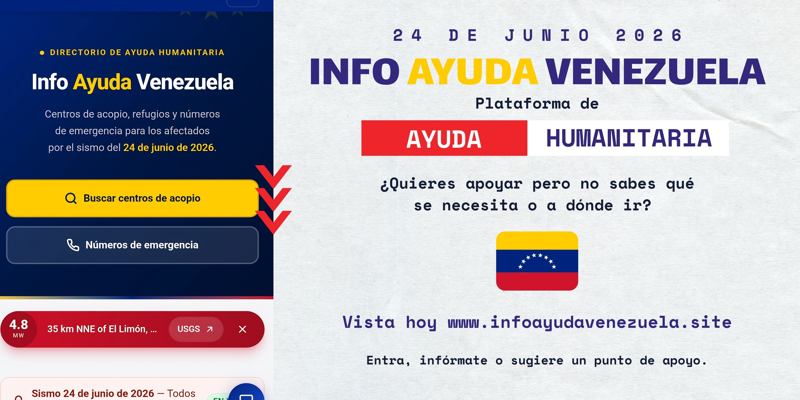

<p align="center">
  
</p>

<p align="center">
  
  
  
  
  
</p>

<p align="center">
  <strong>Encuentra centros de acopio, reporta necesidades urgentes y localiza refugios en todo el país.</strong>
  <br>
  Rápido, ligero y funcional incluso en conexiones móviles inestables.
</p>

<br>

# Info Ayuda Venezuela

El **24 de junio de 2026**, dos sismos de magnitud **7.5 y 7.2** sacudieron la región central de Venezuela. Caracas, Miranda, La Guaira, Aragua y Carabobo fueron los estados más afectados, pero la emergencia movilizó a todo el país.

Esta plataforma **centraliza información crítica** para la respuesta ciudadana: centros de acopio, necesidades urgentes, refugios, noticias, guía de insumos y números de emergencia. Es un proyecto de código abierto impulsado por voluntarios venezolanos.

---

## Funcionalidades

### Información y búsqueda
- **Estados organizados** con indicación visual de zonas afectadas prioritarias
- **Buscador en vivo** — filtra por nombre, ciudad, estado o tipo de insumo
- **Página dedicada por estado** con centros agrupados por ciudad
- **Guía de insumos** por categoría (medicinas, alimentos, higiene, herramientas…)

### Reporte y alertas
- **Reporte de necesidades urgentes** por categoría (agua, alimentos, medicinas, rescate, albergue…)
- **Filtro por estado de necesidad**: crítico / en camino / cubierto
- **Refugios** disponibles y registro de personas refugiadas
- **Noticias** en vivo publicadas desde Supabase
- **Búsqueda de personas** desaparecidas

### Participación ciudadana
- **Sugerir centro de acopio** mediante formulario público (requiere moderación)
- **Sugerir refugio** mediante formulario público
- **Enlaces de ayuda** con botón "Ver más / Ver menos"

### Emergencia y robustez
- **Números de emergencia** nacionales y por categoría (bomberos, protección civil, policía…)
- **Datos en vivo** desde Supabase con fallback offline automático
- **Modo offline** — funciona sin conexión usando datos estáticos embebidos

## Comunidad

Coordinamos la ayuda a través de WhatsApp. Únete para compartir información, coordinar envíos y movilizar recursos:

<p align="center">
  <a href="https://chat.whatsapp.com/EEP3H1bI7Ex0MdVkXNnnxZ" target="_blank" rel="noopener noreferrer" style="display: inline-block; padding: 14px 32px; background: #25D366; color: white; text-decoration: none; border-radius: 8px; font-weight: 600; font-size: 16px;">
    Unirse al grupo de WhatsApp
  </a>
</p>

---

## Estructura del proyecto

```
src/
├── components/       # Componentes Astro
│   ├── Navbar.astro
│   ├── Hero.astro
│   ├── Footer.astro
│   ├── AlertBox.astro
│   ├── StatsRow.astro
│   ├── SearchFilters.astro
│   ├── InsumosSection.astro
│   ├── EnlacesSection.astro
│   ├── RefugiosSection.astro
│   ├── EmergenciaCTA.astro
│   ├── ChatWidget.astro
│   ├── SugerirCentroModal.astro
│   ├── SugerirEnlaceModal.astro
│   ├── SugerirRefugioModal.astro
│   ├── ReportarNecesidadModal.astro
│   └── ReportarRefugiadoModal.astro
├── data/             # Datos estáticos de fallback
│   ├── acopio.json
│   ├── centros.js
│   ├── emergencia.js
│   ├── insumos.js
│   ├── necesidades.js
│   └── numerosemergencia.json
├── layouts/          # Layout base
│   └── Layout.astro
├── lib/              # Utilidades compartidas
│   ├── escape.ts
│   └── supabase.js
├── pages/            # Rutas de la aplicación
│   ├── index.astro
│   ├── emergencia.astro
│   ├── insumos.astro
│   ├── necesidades.astro
│   ├── noticias.astro
│   ├── sobre-nosotros.astro
│   ├── agradecimientos.astro
│   ├── buscar-personas/
│   ├── refugios/
│   └── estado/[estado].astro
├── scripts/          # Seeds de Supabase
│   ├── seed-supabase.js
│   └── seed-numeros-emergencia.js
└── styles/           # Tailwind v4 + tokens
    └── global.css
```

## Desarrollo

```bash
# Instalar dependencias
pnpm install

# Iniciar servidor de desarrollo
pnpm dev

# Compilar para producción
pnpm build

# Previsualizar build
pnpm preview
```

### Variables de entorno

Copia `.env.example` a `.env` y configura las credenciales de Supabase:

```
PUBLIC_SUPABASE_URL=https://tu-proyecto.supabase.co
PUBLIC_SUPABASE_ANON_KEY=tu-anon-key
```

Sin estas variables la app funciona en modo offline con los datos embebidos.

## Contribuir

Este proyecto vive gracias a voluntarios. Toda ayuda suma:

1. Haz [fork del repositorio](https://github.com/Projects-for-Venezuela/infoayudavenezuela/fork)
2. Crea una rama para tu cambio (`git checkout -b feat/mi-aporte`)
3. Haz commit de tus cambios y abre un Pull Request

Si encuentras algo que mejorar o reportar, escribe al equipo de desarrollo — no publiques vulnerabilidades en issues públicos. Para todo lo demás, únete al grupo de WhatsApp o contribuye con código.

---
<p align="center">
  Hecho con ❤️ por la comunidad venezolana — <strong>Porque cuando la solidaridad nos une, la esperanza se vuelve más fuerte</strong>
  <br><br>
  <a href="https://github.com/Projects-for-Venezuela/infoayudavenezuela/graphs/contributors">
    
  </a>
</p>
